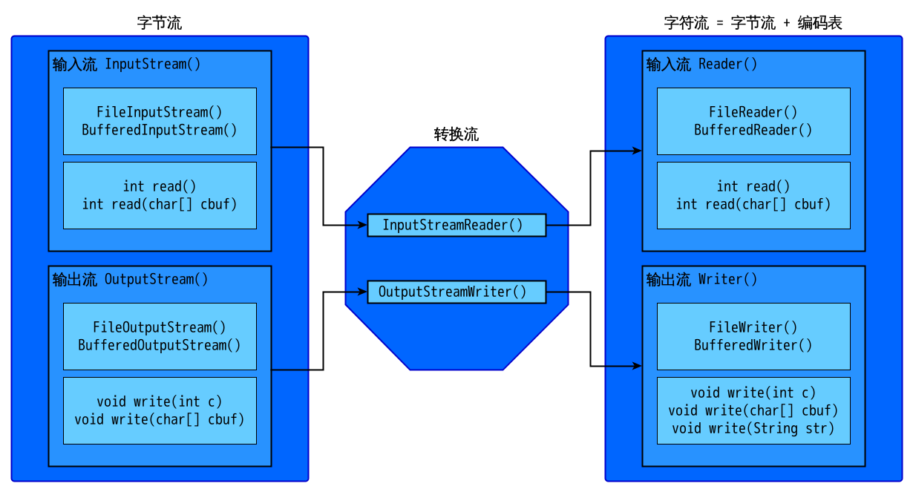

# Java笔记 进阶--输入输出

## 目录 <!-- omit in toc -->

- [1. 异常](#1-%e5%bc%82%e5%b8%b8)
  - [1-1 Throwable 常见方法](#1-1-throwable-%e5%b8%b8%e8%a7%81%e6%96%b9%e6%b3%95)
  - [1-2 如何处理异常](#1-2-%e5%a6%82%e4%bd%95%e5%a4%84%e7%90%86%e5%bc%82%e5%b8%b8)
  - [1-3 面试题](#1-3-%e9%9d%a2%e8%af%95%e9%a2%98)
    - [1-3-1 final finally finalize](#1-3-1-final-finally-finalize)
    - [1-3-2 如果catch中有return，finally还会执行么](#1-3-2-%e5%a6%82%e6%9e%9ccatch%e4%b8%ad%e6%9c%89returnfinally%e8%bf%98%e4%bc%9a%e6%89%a7%e8%a1%8c%e4%b9%88)
  - [1-4 格式](#1-4-%e6%a0%bc%e5%bc%8f)
  - [1-5 自定义异常](#1-5-%e8%87%aa%e5%ae%9a%e4%b9%89%e5%bc%82%e5%b8%b8)
- [2. IO 流](#2-io-%e6%b5%81)
  - [2-1 File 类](#2-1-file-%e7%b1%bb)
    - [2-1-1 构造方法](#2-1-1-%e6%9e%84%e9%80%a0%e6%96%b9%e6%b3%95)
    - [2-1-2 方法](#2-1-2-%e6%96%b9%e6%b3%95)
  - [2-2 IO 流概述](#2-2-io-%e6%b5%81%e6%a6%82%e8%bf%b0)
  - [2-3 FileOutputStream (FileInputStream)](#2-3-fileoutputstream-fileinputstream)
  - [2-4 BufferedOutputStream (BufferedInputStream)](#2-4-bufferedoutputstream-bufferedinputstream)
  - [2-5 Reader/Writer](#2-5-readerwriter)
  - [2-6 转换流](#2-6-%e8%bd%ac%e6%8d%a2%e6%b5%81)
    - [2-6-1 编码问题](#2-6-1-%e7%bc%96%e7%a0%81%e9%97%ae%e9%a2%98)
    - [2-6-1 OutputStreamWriter](#2-6-1-outputstreamwriter)
    - [2-6-2 InputStreamReader](#2-6-2-inputstreamreader)
  - [2-7 其他](#2-7-%e5%85%b6%e4%bb%96)
    - [操作基本数据的流](#%e6%93%8d%e4%bd%9c%e5%9f%ba%e6%9c%ac%e6%95%b0%e6%8d%ae%e7%9a%84%e6%b5%81)
    - [内存操作流](#%e5%86%85%e5%ad%98%e6%93%8d%e4%bd%9c%e6%b5%81)
    - [LineNumberReader](#linenumberreader)
    - [打印流](#%e6%89%93%e5%8d%b0%e6%b5%81)
    - [标准输入输出流](#%e6%a0%87%e5%87%86%e8%be%93%e5%85%a5%e8%be%93%e5%87%ba%e6%b5%81)
    - [随机访问流](#%e9%9a%8f%e6%9c%ba%e8%ae%bf%e9%97%ae%e6%b5%81)
    - [合并流](#%e5%90%88%e5%b9%b6%e6%b5%81)
    - [序列化流](#%e5%ba%8f%e5%88%97%e5%8c%96%e6%b5%81)
  - [2-8 Properties 类](#2-8-properties-%e7%b1%bb)

## 1. 异常

- 异常 Throwable
  - 严重问题 Error
    不处理，这种问题一般很严重，如内存溢出
  - 问题 Exception
    - 编译期问题
      必须处理，不然编译通不过
    - 运行期问题 RuntimeException
      不处理，这是代码问题，要改代码

**注意：**  

1. try 里面代码越少越好
2. catch 里面一定要有东西，哪怕是给出一个简单提示

**JDK7的特殊处理方法：**

```java
try{

}catch(异常名1|异常名2... 变量){

}
```

### 1-1 Throwable 常见方法

`String getMessage()`返回此 throwable 的详细消息字符串。  
`String toString()`返回此 throwable 的简短描述。  
`void printStackTrace()`将此 throwable 及其追踪输出至标准错误流  
`void printStackTrace(PrintStream s)`将此 throwable 及其追踪输出到指定的输出流。  

### 1-2 如何处理异常

原则：内部可以处理，用try，内部处理不了，交给调用者处理，throws  
后面程序要执行，用try，不用执行，就throws

### 1-3 面试题

#### 1-3-1 final finally finalize

- final 修饰用
  - 修饰类：类不能被继承
  - 修饰变量：常量
  - 修饰方法：方法不能被重写
- finally 异常处理的一部分，用于释放资源
  - 一般来说，代码肯定会被执行，有特殊情况
- finalize Object类的一个方法
  - 当垃圾回收器确定没有该对象的更多引用，由垃圾回收器调用此方法

#### 1-3-2 如果catch中有return，finally还会执行么

会！！！

```java
public static int FR() {
    int a = 10;

    try {
        System.out.print(a / 0);
        a = 20;
    } catch (Exception e) {
        a = 30;
        return a;
    } finally {
        a = 40;
    }

    return a;
}
```

**分析：**  
本题会返回30，在第一个`return a;`时返回路径就生成了，直接返回30，但程序并未返回，而是执行`finally`，之后再返回30。

### 1-4 格式

- try...catch  
- try...catch...finally  
- try...catch...catch  
- try...catch...catch...finally  
- try...finally
  - 释放资源

### 1-5 自定义异常

继承自 Exception （检查编译，用的时候需要 throws）  
继承自 RuntimeException （只在运行时检查，不用 throws）  

> 1. 子类重写父类方法时，只能抛父类所抛异常的子类异常  
>    父亲抛 Exception，子类抛具体异常
> 2. 父类抛多个异常，子类只能抛父类异常的子集
> 3. 父类方法没异常，子类打算重写，子类该方法也不能有异常。可以try，但不能throws

## 2. IO 流

**包：** `java.io`  

### 2-1 File 类

`java.io.File`  
文件和目录路径名的抽象**表示**形式。  

#### 2-1-1 构造方法

`File(File parent, String child)`根据 parent 抽象路径名和 child 路径名字符串创建一个新 File 实例。  
`File(String pathname)`通过将给定路径名字符串转换为抽象路径名来创建一个新 File 实例。  
`File(String parent, String child)`根据 parent 路径名字符串和 child 路径名字符串创建一个新 File 实例。  

```java
File file1 = new File("D:\\demo\\a.txt");
File file2 = new File("D:\\demo", "a.txt");

File file3 = new File("D:\\demo");
File file4 = new File(file3, "a.txt");
```

**注意：** 路径最好用 `/` ，它在 Win 和 Linux 下通用。 `\\` 是 `\` 的转义字符。

**注意：** 为了提高代码的跨平台可移植性对于文件路径分隔符也可以使用`File.separator`表示文件路径分隔符

```java
File file = new File("test"+File.separator+"test.txt");
// file的相对路径就是test下的test.txt
```

#### 2-1-2 方法

**创建：**  
`boolean createNewFile()`当且仅当不存在具有此抽象路径名指定名称的文件时，不可分地创建一个新的空文件。  
`boolean mkdir()`创建此抽象路径名指定的目录。  
`boolean mkdirs()`创建此抽象路径名指定的目录，包括所有必需但不存在的父目录。  

**删除：**  
`boolean delete()`删除此抽象路径名表示的文件或目录。  
> 有子目录不能删除  
> 回收站里找不到文件的  

**重命名：**  
`boolean renameTo(File dest)`重新命名此抽象路径名表示的文件。  
> 参数是一个 File 对象  
> 比起重命名，更像Linux中的`mv`命令，相当于剪切。

**判断：**  
`boolean isDirectory()`测试此抽象路径名表示的文件是否是一个目录。  
`boolean isFile()`测试此抽象路径名表示的文件是否是一个标准文件。  
`boolean isHidden()`测试此抽象路径名指定的文件是否是一个隐藏文件。  
`boolean exists()`测试此抽象路径名表示的文件或目录是否存在。  
`boolean canRead()`测试应用程序是否可以读取此抽象路径名表示的文件。  
`boolean canWrite()`测试应用程序是否可以修改此抽象路径名表示的文件。  

**获取：**  
`String getAbsolutePath()`返回此抽象路径名的绝对路径名字符串。  
`String getName()`返回由此抽象路径名表示的文件或目录的名称。  
`String getPath()`将此抽象路径名转换为一个路径名字符串。  
`long lastModified()`返回此抽象路径名表示的文件最后一次被修改的时间。  
`long length()`返回由此抽象路径名表示的文件的长度。  

**高级获取：**  
`String[] list()`返回一个字符串数组，这些字符串指定此抽象路径名表示的目录中的文件和目录。  
`File[] listFiles()`返回一个抽象路径名数组，这些路径名表示此抽象路径名表示的目录中的文件。  

**文件名过滤器**  
FilenameFilter 接口，自己写它的实现类。（在要用的位置重写即可）

### 2-2 IO 流概述

**分类：**  

|  分类  |     作用     |
| :----: | :----------: |
| 输入流 |   读取数据   |
| 输出流 |   写入数据   |
| 字节流 | 操作任何文件 |
| 字符流 | 操作文本文件 |

**抽象基类：**  

| 分类       | 类名         |
| ---------- | ------------ |
| 字节输入流 | InputStream  |
| 字节输出流 | OutputStream |
| 字符输入流 | Reader       |
| 字符输出流 | Writer       |

这四个类的子类都是以父类名作后缀



### 2-3 FileOutputStream (FileInputStream)  

**构造方法：**  
`FileOutputStream(File file)`创建一个向指定 File 对象表示的文件中写入数据的文件输出流。  
`FileOutputStream(String name)`创建一个向具有指定名称的文件中写入数据的输出文件流。

> FileOutputStream同理  

`FileOutputStream(File file, boolean append)`创建一个向指定 File 对象表示的文件中写入数据的文件输出流。  
`FileOutputStream(String name, boolean append)`创建一个向具有指定 name 的文件中写入数据的输出文件流。  

> 追加写入 append == true  

**FileOutputStream 与父类共有方法：**  
`void close()`关闭此文件输出流并释放与此流有关的所有系统资源。  
`void write(byte[] b)`将 b.length 个字节从指定 byte 数组写入此文件输出流中。  
`void write(byte[] b, int off, int len)`将指定 byte 数组中从偏移量 off 开始的 len 个字节写入此文件输出流。  
`void write(int b)`将指定字节写入此文件输出流。  

**FileInputStream 与父类共有方法：**  
`int read()`从此输入流中读取一个数据字节。  
`int read(byte[] b)`从此输入流中将最多 b.length 个字节的数据读入一个 byte 数组中。  
> 如果读取到 -1 表示读完了  
> `int read(byte[] b)`返回实际读取的字节数

### 2-4 BufferedOutputStream (BufferedInputStream)  

**引入：** 文件那里，一个数组一个数组的输入太蠢了，需要提高效率！故引入缓冲区  

**构造方法：**  
`BufferedOutputStream(OutputStream out)`创建一个新的缓冲输出流，以将数据写入指定的底层输出流。  
`BufferedOutputStream(OutputStream out, int size)`创建一个新的缓冲输出流，以将具有指定缓冲区大小的数据写入指定的底层输出流。  

> 缓冲区是为了**高效输入输出**设计的，真正的读写都靠基类的其他子类！  

```java
BufferedOutputStream bos = new BufferedOutputStream(
        new FileOutputStream(a.txt));
```

> BufferedInputStream 同理  

**方法：**  

`void write(byte[] b, int off, int len)`将指定 byte 数组中从偏移量 off 开始的 len 个字节写入此缓冲的输出流。  
`void write(int b)`将指定的字节写入此缓冲的输出流。  

> 可以一个字节一个字节的输，也可以一次输出。  

**高效复制文件：**  

```java
// 将 sorFile 复制到 desFile
public static void method(String sorFile, String desFile) throws IOException {
    BufferedInputStream ios = new BufferedInputStream(new FileInputStream(sorFile));
    BufferedOutputStream bos = new BufferedOutputStream(new FileOutputStream(desFile));

    byte[] temp = new byte[1024];
    int len = 0;
    while ((len = ios.read(temp)) != -1) {
        bos.write(temp, 0, len);
    }

    bos.close();
    ios.close();
}
```

### 2-5 Reader/Writer

同上。  

### 2-6 转换流  

#### 2-6-1 编码问题  

`String(byte[] bytes, Charset charset)`通过使用指定的 charset 解码指定的 byte 数组，构造一个新的 String。  

`byte[] getBytes(Charset charset)`使用给定的 charset 将此 String 编码到 byte 序列，并将结果存储到新的 byte 数组。  

**编码：**  

```java
String s = "我能吞下玻璃而不伤身体";
byte[] code = s.getBytes("UTF-8");
System.out.println(Arrays.toString(code));
```

**解码：**  

```java
String uncode = new String(code, "UTF-8");
System.out.println(uncode);
```

#### 2-6-1 OutputStreamWriter  

**构造函数：**
`OutputStreamWriter(OutputStream out)`创建使用默认字符编码的 OutputStreamWriter。  
`OutputStreamWriter(OutputStream out, String charsetName)`创建使用指定字符集的 OutputStreamWriter。

> 用 write 写入，可以直接写字符串。共五种写法，继承自 Writer。

#### 2-6-2 InputStreamReader  

`InputStreamReader(InputStream in)`创建一个使用默认字符集的 InputStreamReader。  
`InputStreamReader(InputStream in, String charsetName)`创建使用指定字符集的 InputStreamReader。  

> `int read(char[] cbuf, int offset, int length)`将字符读入数组中的某一部分。  
> 有两种读法。  

### 2-7 其他  

#### 操作基本数据的流  

DataInputStream/DataOutputStream  

#### 内存操作流

处理临时存储的内存信息  

1. 操作字节数组  
   ByteArrayInputStream  
   ByteArrayOutputStream  
2. 操作字符数组  
   CharArrayReader  
   CharArrayWriter  
3. 操作字符串  
   StringReader  
   StringWriter  

#### LineNumberReader  

父类是 `BufferedReader`  
`int getLineNumber()`获得当前行号。  
`void setLineNumber(int lineNumber)`设置当前行号。  

#### 打印流  

PrintStream/PrintWriter  

1. 只能操作输出，不能操作输入（只有输出）  
2. 可以操作任意类型数据  
3. 自动刷新（可选）  
4. 直接操作文件  

基本流：直接写文件  
高级流：基本流上获得其他功能  

#### 标准输入输出流

System 类：  
`static InputStream in`“标准”输入流。  
`static PrintStream out`“标准”输出流。  

键盘录入的三种方式：  

1. main 的 args 参数接收数据  
2. `Scanner sc = new Scanner(System.in);`  
3. `InputStream is = System.in;`  

#### 随机访问流  

`RandomAccessFile` 有一个文件指针，通过 getFilePointer 获取，seek 设置  

`RandomAccessFile(File file, String mode)`创建从中读取和向其中写入（可选）的随机访问文件流，该文件由 File 参数指定。  
`RandomAccessFile(String name, String mode)`创建从中读取和向其中写入（可选）的随机访问文件流，该文件具有指定名称。  

> mode: r, rw, rws, rwd  
> rws 每次更改均保存  
> rwd 每次文件内容更改均保存  

#### 合并流  

SequenceInputStream  

`SequenceInputStream(Enumeration<? extends InputStream> e)`顺序读取多个元素。  
`SequenceInputStream(InputStream s1, InputStream s2)`顺序读取 s1 和 s2 。  

> Vector.elements() 返回 Enumeration ，是元素的枚举。  

#### 序列化流  

ObjectOutputStream 序列化流  
ObjectInputStream 反序列化流  

使用该功能的类需要实现 serializable 接口。该接口没有任何方法，我们称之为标记接口  

**问题1：**  

每次向一个文件中序列化对象时 ，每次只想向文件末尾追加对象，而不是覆盖，可以使用FileInputStream（文件名，true）；在读取数据的时候第一次会正常读取，不会报错，当读取第二次的时候，就会报出java.io.StreamCorruptedException: invalid type code: AC的错误。  

**问题分析：**  
由于用FileInputStream（文件名，true）向同一个文件中序列化对象，每次都会向文件中序列化一个header。在反序列化的时候每个 ObjectInputStream 对象只会读取一个header，那么当遇到第二个的时候就会报错，导致出现异常。

**解决：**  

1. 运用集合  
2. 重写 ObjectOutputSream 的 writeStreamHeader() 方法  
3. 在反序列化的while循环中，每次都创建一个新的 ObjectInputStream 用来读取 header  

**问题2：**  
类改了，但以前的数据还想要  

**解决：**  
serialVersionUID，可自动添加  

**问题2：**  
某些变量不要序列化  

**解决：**  
transient 关键字  

### 2-8 Properties 类  

**包：** `java.util`  
**父类：** `Hashtable<K,V>`  

`void list(PrintStream out)`将属性列表输出到指定的输出流。  
`void list(PrintWriter out)`将属性列表输出到指定的输出流。  
`void load(InputStream inStream)`从输入流中读取属性列表（键和元素对）。  
`void load(Reader reader)`按简单的面向行的格式从输入字符流中读取属性列表（键和元素对）。  
